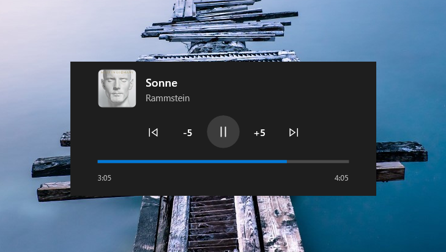
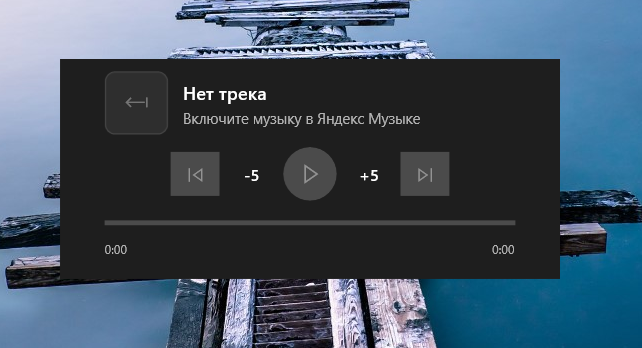

# Yandex Music widget for Xbox Game Bar

[](https://github.com/Hehehers1488/yandex-music-gamebar-widget/actions/workflows/ci.yml)

A small UWP widget that shows the currently playing Yandex Music track and lets you control it
(play/pause, next, previous) right inside the Xbox Game Bar overlay (Win + G) — without switching
out of the game.

The widget reads track info through the system media session (SMTC) published by the
Yandex Music desktop app. No tokens, no accounts, no extra services.



---

## Features

- Current track: title, artist, album art, progress bar with elapsed/total time
- Controls: play/pause, next, previous, seek (click/drag the progress bar, ±5s buttons)
- Interface scales proportionally with the window size
- Auto-picks the Yandex Music media session (won't touch Spotify/Groove/etc.)
- Works on Windows 10 2004+ (build 19041) and Windows 11, x64 / ARM64
- Distributed as a signed MSIX package

## Screenshots

Widget with a track playing (regular and enlarged window):


Widget when nothing is playing:



## Installation

> Windows may show a SmartScreen / "Unknown publisher" warning — the package is signed with a
> self-signed certificate. This is expected for a hobby project; review and accept.

**Easiest way (no command line needed):**
1. Go to [Releases](https://github.com/Hehehers1488/yandex-music-gamebar-widget/releases) and download **`install.bat`**.
2. Double-click `install.bat`. It downloads and installs everything itself.
3. Open **Xbox Game Bar** (Win + G) → **Widgets** → find **Yandex Music** → click to add it.
4. Play a track in the Yandex Music app. The widget updates automatically.

Alternative (PowerShell):
```powershell
powershell -ExecutionPolicy Bypass -File .\install.ps1
```

Or run straight from PowerShell without downloading anything:
```powershell
Set-ExecutionPolicy -Scope Process -ExecutionPolicy Bypass -Force
irm https://github.com/Hehehers1488/yandex-music-gamebar-widget/releases/latest/download/install.ps1 | iex
```

Manual install: grab `YMusicGameBarWidget_x64.msix` + `YMusicGameBarWidget.cer` from a release,
import the `.cer` into **Trusted People** (`certmgr.msc` → Current User → Trusted People),
then `Add-AppxPackage -Path .\YMusicGameBarWidget_x64.msix`.

## FAQ

**How do I uninstall?**
Settings → Apps → Installed apps → find "Yandex Music Widget" → Uninstall.
Or: `Get-AppxPackage -Name "YMusicGameBarWidget" | Remove-AppxPackage`.
The widget stores no user data. A leftover certificate in "Trusted People" is harmless
(you can remove it via `certmgr.msc`).

**Why does Windows show a SmartScreen / "Unknown publisher" warning?**
The package is signed with a self-signed certificate (this project's own, not issued by a
public CA). The installer puts that certificate into "Trusted People" — you're telling Windows
"this specific certificate is OK". It grants nothing else and is used only during install.

**Where are playlists, shuffle, repeat, like?**
The Yandex Music desktop app does not expose shuffle/repeat/like over the system media session
(SMTC) — it ignores such commands and reports no state. Playlists and "My Wave" require the
Yandex Music API (account login), which is on the roadmap.

**Does the widget work in fullscreen games?**
Xbox Game Bar overlay works in most fullscreen games (Win + G). The widget needs the Yandex
Music app to be running and playing a track.

**Is the window resizable?**
Yes — drag its edges; the whole UI scales proportionally (min 280×120, max 500×220).

## Building from source

Requirements: Visual Studio 2022 Build Tools with **Universal Windows Platform** workload
(`Microsoft.VisualStudio.Workload.UniversalBuildTools`) and Windows 10 SDK 19041.

```powershell
# create a local signing certificate (tools/make-cert.ps1)
.\tools\make-cert.ps1

# build an installable MSIX
msbuild src\YMusicGameBarWidget\YMusicGameBarWidget.csproj `
  /t:Restore,Build `
  /p:Configuration=Release /p:Platform=x64 `
  /p:AppxPackageSigningEnabled=true `
  /p:PackageCertificateKeyFile="..\..\certs\YMusicWidget.pfx" `
  /p:PackageCertificatePassword=YMusicWidget `
  /p:UapAppxPackageBuildMode=SideloadOnly `
  /p:AppxPackageDir="..\..\AppPackages" `
  /p:AppxBundle=Never /p:GenerateAppxPackageOnBuild=true
```

Then install with `.\tools\install-local.ps1` (or the manual steps above).

## Roadmap

- [ ] Phase 2: built-in player inside the widget via the unofficial Yandex Music API
      (OAuth Device Flow) — search, playlists, full queue control
- [ ] Proper widget icons / tile branding
- [ ] Settings (session override, theme)

## License

[MIT](LICENSE). Not affiliated with Yandex. Yandex Music is a trademark of Yandex LLC.

---

# Виджет Яндекс Музыки для Xbox Game Bar

[](https://github.com/Hehehers1488/yandex-music-gamebar-widget/actions/workflows/ci.yml)

Небольшой UWP-виджет, который показывает текущий трек Яндекс Музыки и позволяет управлять им
(играть/пауза, следующий, предыдущий) прямо в оверлее Xbox Game Bar (Win + G) — не выходя из игры.

Виджет читает информацию о треке через системную медиа-сессию (SMTC), которую публикует
десктопное приложение Яндекс Музыки. Никаких токенов, аккаунтов и сторонних сервисов.


---

## Возможности

- Текущий трек: название, исполнитель, обложка, прогресс с временем
- Управление: play/pause, следующий, предыдущий, перемотка (клик по прогресс-бару, кнопки ±5 сек)
- Интерфейс масштабируется пропорционально размеру окна
- Автоматически выбирает сессию именно Яндекс Музыки (Spotify/Groove и др. не трогает)
- Windows 10 2004+ (build 19041) и Windows 11, x64 / ARM64
- Распространяется как подписанный MSIX-пакет

## Скриншоты

Виджет с играющим треком (обычное и увеличенное окно):


Виджет, когда ничего не играет:


## Установка

> Windows может показать предупреждение SmartScreen / «Неизвестный издатель» — пакет подписан
> самоподписанным сертификатом. Для пет-проекта это нормально; проверьте и примите.

**Самый простой способ (без командной строки):**
1. Откройте [Releases](https://github.com/Hehehers1488/yandex-music-gamebar-widget/releases) и скачайте **`install.bat`**.
2. Запустите `install.bat` двойным кликом — он сам скачает и установит всё.
3. Откройте **Xbox Game Bar** (Win + G) → **Виджеты** → найдите **Yandex Music** → добавьте.
4. Включите трек в приложении Яндекс Музыки — виджет обновится автоматически.

Альтернатива (PowerShell):
```powershell
powershell -ExecutionPolicy Bypass -File .\install.ps1
```

Или сразу из PowerShell, ничего не скачивая:
```powershell
Set-ExecutionPolicy -Scope Process -ExecutionPolicy Bypass -Force
irm https://github.com/Hehehers1488/yandex-music-gamebar-widget/releases/latest/download/install.ps1 | iex
```

Ручная установка: возьмите `YMusicGameBarWidget_x64.msix` + `YMusicGameBarWidget.cer` из релиза,
импортируйте `.cer` в **Доверенные люди** (`certmgr.msc` → Текущий пользователь → Доверенные люди),
затем `Add-AppxPackage -Path .\YMusicGameBarWidget_x64.msix`.

## FAQ

**Как удалить?**
Параметры → Приложения → «Яндекс Музыка Виджет» → Удалить.
Или: `Get-AppxPackage -Name "YMusicGameBarWidget" | Remove-AppxPackage`.
Виджет не хранит никаких данных. Оставшийся сертификат в «Доверенных людях» безвреден
(можно удалить через `certmgr.msc`).

**Почему Windows показывает «Неизвестный издатель» / SmartScreen?**
Пакет подписан самодельным сертификатом (собственным для проекта, а не выпущенным публичным ЦС).
Установщик кладёт этот сертификат в «Доверенные люди» — так вы говорите Windows «вот этому
сертификату доверяем». Никаких других прав он не даёт и нужен только на время установки.

**Где плейлисты, перемешивание, повтор, лайк?**
Десктопное приложение Яндекс Музыки не отдаёт и не принимает эти команды через системную
медиа-сессию (SMTC). Плейлисты и «Моя волна» требуют официального API Яндекса (вход в аккаунт) —
в планах.

**Виджет работает в полноэкранных играх?**
Оверлей Xbox Game Bar работает в большинстве полноэкранных игр (Win + G). Для работы нужно,
чтобы приложение Яндекс Музыки было запущено и играло трек.

**Окно можно менять в размере?**
Да — тяните края; весь интерфейс масштабируется пропорционально (мин. 280×120, макс. 500×220).

## Сборка из исходников

Требуется Visual Studio 2022 Build Tools с нагрузкой **Универсальная платформа Windows**
(`Microsoft.VisualStudio.Workload.UniversalBuildTools`) и Windows 10 SDK 19041.

```powershell
# создать локальный сертификат подписи (tools/make-cert.ps1)
.\tools\make-cert.ps1

# собрать устанавливаемый MSIX
msbuild src\YMusicGameBarWidget\YMusicGameBarWidget.csproj `
  /t:Restore,Build `
  /p:Configuration=Release /p:Platform=x64 `
  /p:AppxPackageSigningEnabled=true `
  /p:PackageCertificateKeyFile="..\..\certs\YMusicWidget.pfx" `
  /p:PackageCertificatePassword=YMusicWidget `
  /p:UapAppxPackageBuildMode=SideloadOnly `
  /p:AppxPackageDir="..\..\AppPackages" `
  /p:AppxBundle=Never /p:GenerateAppxPackageOnBuild=true
```

Установка собранного пакета: `.\tools\install-local.ps1` (или ручные шаги выше).

## Планы

- [ ] Фаза 2: встроенный плеер в виджете через неофициальный API Яндекс Музыки
      (OAuth Device Flow) — поиск, плейлисты, полный контроль очереди
- [ ] Собственные иконки виджета / тайлов
- [ ] Настройки (переопределение сессии, тема)

## Лицензия

[MIT](LICENSE). Не аффилирован с Яндексом. Яндекс Музыка — товарный знак ООО «Яндекс».
